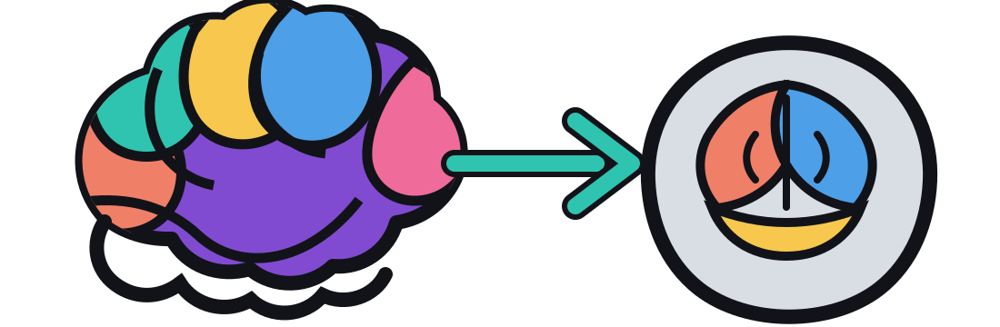

# dissec → atlas

<p align="center">
  
</p>

`dissec-to-atlas` is a local browser workstation for assigning physically dissected
tissue pieces to regions in a 3D reference atlas. It was designed for coronal mouse
brain sections that may be partial, torn, photographed after dissection, or arranged
as several images on a presentation slide.

The app combines a reproducible atlas plane with human anatomical judgment:

- crop one tissue photograph from a larger slide image;
- scroll through the Allen CCF and tilt the coronal plane in yaw and pitch;
- request a coarse, advisory image-alignment suggestion;
- extract candidate piece outlines from closed red hand-drawn boundaries;
- correct the registration with paired landmarks and direct transform controls;
- draw polygons or drag candidate vertices, then assign each workbook tissue code;
- calculate the fraction of that polygon in every Allen structure;
- save immutable revisions, reload earlier work, reset, and export a long CSV table.

Experimental images stay on your machine. A project manifest stores paths to them;
the application never modifies those source files.

## Why manual correction is central

Automated registration is useful for intact sections with clean contrast. Physical
microdissection removes the very boundaries that an automated method needs, and a
photograph can contain tears, missing pieces, handwritten lines, or unknown flips.
The automatic result is therefore labelled *advisory*. The saved scientific result
is the atlas plane, the transform, the user-reviewed polygons, and their provenance.

The workflow takes inspiration from
[SHARP-Track](https://github.com/cortex-lab/allenCCF/tree/master/SHARP-Track),
which pairs atlas navigation with manual histology registration, and from the
[IBL alignment tools](https://github.com/AllenNeuralDynamics/ibl-ephys-alignment-gui),
which preserve editable alignment histories. This application focuses on areas in a
section rather than probe trajectories. Atlas access is provided by the
[BrainGlobe Atlas API](https://github.com/brainglobe/brainglobe-atlasapi).

## Install

Python 3.11 or newer and [`uv`](https://docs.astral.sh/uv/) are recommended.

```bash
git clone https://github.com/andrestrocyte/dissec_to_atlas.git
cd dissec_to_atlas
uv sync --extra allen
```

The first real project launch downloads `allen_mouse_25um` through BrainGlobe if it
is not already cached. To explore the interface without downloading atlas data:

```bash
uv run dissec-to-atlas --demo
```

## Create a project

Create a folder outside the repository and add `project.json`. Image paths may be
absolute or relative to that JSON file.

```json
{
  "schema_version": 1,
  "project_id": "mouse-001",
  "name": "Mouse 001 microdissections",
  "atlas_id": "allen_mouse_25um",
  "slides": [
    {
      "id": "1",
      "display_name": "Slide 1 · section A",
      "physical_slide": "1",
      "image_path": "/path/to/source/slide-1.png",
      "atlas_ap_index_hint": 125,
      "source_atlas_plate_hints": [32],
      "tissue_pieces": [
        {"code": "1/1", "plate": 1, "well": "A1"},
        {"code": "1/2", "plate": 1, "well": "A2", "notes": "damaged edge"}
      ]
    }
  ]
}
```

`atlas_ap_index_hint` is an initial **atlas voxel index**, from the anterior atlas
origin. `source_atlas_plate_hints` preserves printed plate numbers from a book or
planning file. The two fields are deliberately distinct because a printed plate
number is not generally a CCF voxel index.

Launch the project:

```bash
uv run dissec-to-atlas /absolute/path/to/project.json
```

The application listens on `127.0.0.1:8765`. Use `--port` to change the port and
`--no-browser` to prevent automatic browser opening.

When one physical slide contains tissue pieces from more than one anatomical plane,
create one manifest entry per plane with a unique `id`, the same `physical_slide`,
and a clear `display_name`. This prevents one transform or AP coordinate from being
silently applied to pieces that belong on an adjacent section.

## Registration workflow

1. **Isolate a section.** Drag a crop around a single tissue photograph. Keep scale
   bars and annotations outside the crop when possible.
2. **Find the plane.** Move along the anterior-posterior slider. Adjust yaw and pitch
   when the two hemispheres or dorsal/ventral landmarks do not appear at one level.
3. **Try the suggestion.** The coarse alignment searches nearby planes and both
   left-right orientations with edge-based affine ECC. Treat the score as a relative
   search aid, not biological confidence.
4. **Correct with landmarks.** Click a point in the tissue view and the matching
   point in the atlas view. Two pairs fit a similarity transform; three or more fit
   an affine transform. Prefer ventricular corners, the midline, hippocampal turns,
   major white-matter boundaries, and the pial surface.
5. **Draw pieces.** Choose the physical tissue code and press **+ Draw polygon**.
   Click points on the atlas overlay, then press **Finish polygon** (or Enter).
   **Cancel drawing (Esc)** abandons only the unfinished draft. Completed polygons
   appear in **Annotations** immediately; click an entry or polygon to select it,
   drag its white handles, assign another code, or press **Delete polygon**. Undo and
   Redo remain available even when a draft is unfinished. The app samples the
   annotation volume and reports every intersected structure. If the source uses
   closed red boundary lines, **Suggest outlines from red marks** can seed polygons.
   These are deliberately named `candidate_N`; select each candidate, assign its
   tissue code, and drag its vertices before marking the registration reviewed.
6. **Review and save.** The newest saved checkpoint opens automatically. Changes are
   also written to an immutable autosave revision after a short pause, and a browser
   recovery copy protects unfinished drawings. **History** opens older checkpoints;
   **This section / All sections** controls the annotation list. Save creates a
   timestamped JSON in `revisions/` and updates `latest.json`. Existing revisions are
   never overwritten. CSV export creates one row per tissue-piece/Allen-region
   intersection.

Useful shortcuts: <kbd>Ctrl/Cmd</kbd>+<kbd>S</kbd> saves; <kbd>Enter</kbd> closes the
current polygon.

## Coordinate and output contract

The 25 µm BrainGlobe volume is indexed as anterior-posterior, dorsal-ventral,
left-right, using image (`ij`) coordinates from the upper-left origin. Every saved
revision records:

- the source slide id and SHA-256 digest;
- atlas id, resolution, shape, section index, yaw, pitch, and hemisphere view;
- atlas data version, citation, and a SHA-256 digest of its metadata manifest;
- crop, flip, automatic and manual transforms;
- landmark pairs;
- polygon vertices, tissue code, creation time, and region fractions.

The source-image digest detects later file replacement. A saved revision is
self-contained except for the source image and the standard atlas download.

Region fractions describe the area of a drawn **2D polygon** at its chosen oblique
plane. They do not estimate the volume of the dissected piece or correct for section
thickness, tissue deformation outside the affine model, or uncertainty in the cut.

## Data stewardship

Keep project folders, images, workbooks, and revision files outside the public code
checkout. `.gitignore` excludes common experimental formats and `projects/`/`data/`
as a second line of defence. Before sharing a project, inspect its manifest because
absolute paths can contain identifying folder names.

For damaged or ambiguously oriented sections, set `review_required: true` and explain
the reason in `notes`. A registration is not complete until a person has reviewed
the atlas plane, orientation, crop, transform, and every tissue-code assignment.

## Development

```bash
uv sync --extra dev --extra allen
uv run ruff check .
uv run pytest -q
```

The synthetic provider makes the tests and demo independent of network access and
the Allen download. The Allen integration is smoke-tested separately against the
real BrainGlobe atlas.

## License and atlas attribution

The application code is MIT licensed. Allen CCF and BrainGlobe data/code retain
their own licenses and citation requirements. Cite the Allen CCF publication and
BrainGlobe Atlas API when those resources support an analysis.
